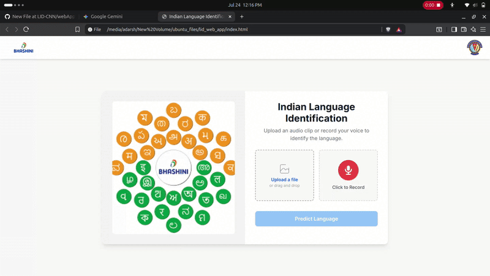

<div align="center">

  <h1 align="center">🇮🇳 Indian Language Identification from Speech 🗣️</h1>
  
  <p align="center">
    A web application that identifies spoken Indian languages from an audio clip using a CRNN deep learning model.
    <br />
    <a href="#-how-to-use"><strong>View Demo »</strong></a>
    ·
    <a href="https://github.com/YOUR_USERNAME/YOUR_REPO/issues">Report Bug</a>
    ·
    <a href="https://github.com/YOUR_USERNAME/YOUR_REPO/issues">Request Feature</a>
  </p>
</div>

<div align="center">


</div>

---

<!-- PROJECT DEMO -->
> **Note:** Add a GIF or screenshot of your project in action here!



---

## ✨ Features

-   **🌐 Multi-Language Support**: Identifies 4 major Indian languages (**Hindi, Malayalam, Marathi, Punjabi**).
-   **🖥️ Web-Based UI**: Easy-to-use interface built with Flask, HTML, and Tailwind CSS.
-   **🎤 Dual Input Modes**: Supports both file upload (`.wav`, `.mp3`) and live audio recording from the microphone.
-   **✂️ Intelligent Slicing**: For audio longer than 5 seconds, the app automatically slices the audio, analyzes each chunk, and returns the prediction with the highest confidence.
-   **📈 Confidence Score**: Displays the model's confidence in its prediction.
-   **⚡ Real-time Feedback**: The UI provides loading states and clear error messages for a smooth user experience.

---

## 🛠️ Tech Stack & Libraries

-   **Backend**: Python, Flask
-   **Machine Learning**: TensorFlow/Keras
-   **Audio Processing**: Librosa
-   **Frontend**: HTML, Tailwind CSS, JavaScript

---

## 🧠 Model Architecture

The core of this application is a **Convolutional Recurrent Neural Network (CRNN)**. This architecture is well-suited for audio classification tasks:

1.  **CNN Layers**: The initial convolutional layers act as feature extractors. They process the Mel-frequency cepstral coefficients (MFCCs) of the audio to identify relevant patterns.
2.  **RNN Layers**: The features are then fed into Bidirectional Gated Recurrent Units (GRUs). These recurrent layers process the data sequentially, capturing temporal relationships within the speech.
3.  **Dense Layers**: Finally, fully connected layers classify the features into one of the target languages.

---

## 🚀 Getting Started

To get a local copy up and running, follow these simple steps.

### Prerequisites

-   Python 3.8+
-   `pip` package manager

### Installation

1.  **Clone the Repository**
    ```sh
    git clone [https://github.com/YOUR_USERNAME/YOUR_REPO.git](https://github.com/YOUR_USERNAME/YOUR_REPO.git)
    cd YOUR_REPO
    ```

2.  **Create and Activate a Virtual Environment**
    ```sh
    # For Windows
    python -m venv venv
    venv\Scripts\activate

    # For macOS/Linux
    python3 -m venv venv
    source venv/bin/activate
    ```

3.  **Install Dependencies**
    <details>
      <summary>Create a <b>requirements.txt</b> file with the following content:</summary>
    
      ```txt
      Flask
      Flask-Cors
      numpy
      tensorflow
      librosa
      ```
    </details>
    
    Then, run the installation command:
    ```sh
    pip install -r requirements.txt
    ```

4.  **Download Model Weights**
    -   You will need the pre-trained model weights file.
    -   Make sure `language_identification_model.h5` is present in the root directory of the project.

5.  **Run the Application**
    Start the Flask server:
    ```sh
    python app.py
    ```
    The application will be running at `http://127.0.0.1:5000`.

---

## 📋 How to Use

1.  Open your web browser and navigate to `http://127.0.0.1:5000`.
2.  **To Upload a File**:
    -   Drag and drop an audio file (`.wav`, `.mp3`) onto the designated area.
    -   Or, click the upload area to select a file from your computer.
3.  **To Record Audio**:
    -   Click the red microphone button to start recording.
    -   Click the stop icon to finish recording.
4.  An audio player will appear, allowing you to listen to the selected or recorded audio.
5.  Click the **Predict Language** button.
6.  The result, along with the confidence score, will be displayed below.

---

## 📂 File Structure

```
.
├── app.py                      # Main Flask application script
├── index.html                  # Frontend user interface
├── language_identification_model.h5 # Pre-trained model weights (to be added)
└── requirements.txt            # Project dependencies
```

---

## 🤝 Contributing

Contributions are what make the open-source community such an amazing place to learn, inspire, and create. Any contributions you make are **greatly appreciated**.

If you have a suggestion that would make this better, please fork the repo and create a pull request. You can also simply open an issue with the tag "enhancement".

1.  Fork the Project
2.  Create your Feature Branch (`git checkout -b feature/AmazingFeature`)
3.  Commit your Changes (`git commit -m 'Add some AmazingFeature'`)
4.  Push to the Branch (`git push origin feature/AmazingFeature`)
5.  Open a Pull Request
