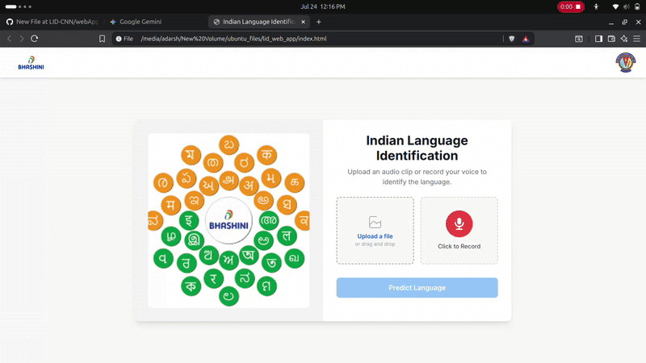

<div align="center">

<br />

# Bhashini Internship 2025
### Speech & Language Technologies for Indian Languages

<p align="center">
  Developed during the <strong>Summer 2025 internship with the Digital India Bhashini Mission</strong> — an end-to-end Language Identification (LID) system for diverse Indian languages, encompassing model development, fine-tuning, and web deployment.
</p>

<br />

[](https://python.org)
[](https://flask.palletsprojects.com)
[](https://tensorflow.org)
[](https://keras.io)
[](./LICENSE)

<br />

[View Demo](#-demo) · [Report Bug](https://github.com/idealxdxrsh/BHASHINI-Internship-2025/issues) · [Request Feature](https://github.com/idealxdxrsh/BHASHINI-Internship-2025/issues)

<br />

</div>

---

## Table of Contents

- [About the Project](#-about-the-project)
- [Key Contributions](#-key-contributions)
- [Demo](#-demo)
- [Features](#-features)
- [Architecture](#-model-architecture)
- [Technology Stack](#%EF%B8%8F-technology-stack)
- [Getting Started](#-getting-started)
- [Usage](#-usage)
- [Contributing](#-contributing)

---

## About the Project

This repository documents the primary deliverable from my internship with the **Digital India Bhashini Mission** — a government initiative under the Ministry of Electronics and Information Technology (MeitY) focused on building AI-powered language technology for Indian languages.

The central project is a production-ready, web-based **Language Identification (LID) system** capable of detecting spoken Indian languages from audio input, supporting both file upload and live microphone recording.

---

## Key Contributions

| Area | Contribution |
|---|---|
| **Language Identification** | Designed and trained a CRNN model on MFCCs for 10 Indian languages |
| **ASR Fine-tuning** | Fine-tuned OpenAI Whisper and AI4Bharat's IndicWav2Vec for Indic speech |
| **Pronunciation Modeling** | Integrated `IndicG2P` for phoneme-level linguistic analysis |
| **Audio Preprocessing** | Built a Voice Activity Detection (VAD) pipeline for noisy, real-world audio |
| **Web Deployment** | Developed a Flask web application with a Tailwind CSS frontend |

---

## Demo

> Live demonstration of the Language Identification web application.



---

## Features

- **Multi-Language Detection** — Identifies 4 major Indian languages: Hindi, Malayalam, Marathi, and Punjabi
- **Dual Input Modes** — Supports `.wav`/`.mp3` file upload and live microphone recording
- **Intelligent Audio Slicing** — Automatically segments audio longer than 5 seconds, analyzes each chunk, and returns the highest-confidence prediction
- **Confidence Scoring** — Displays the model's prediction probability alongside the result
- **Responsive Web UI** — Clean, browser-based interface with real-time loading states and error handling
- **HPC-Trained Model** — Training orchestrated via Slurm on High-Performance Computing clusters

---

## Model Architecture

The system is built on a **Convolutional Recurrent Neural Network (CRNN)** designed for audio classification:

```
Input Audio
    │
    ▼
MFCC Feature Extraction (librosa)
    │
    ▼
CNN Blocks  ──────  Spatial feature extraction from spectrogram
    │
    ▼
Bidirectional GRU Layers  ──────  Temporal sequence modeling
    │
    ▼
Dense + Softmax  ──────  Language classification
```

1. **CNN Layers** — Extract discriminative patterns from Mel-Frequency Cepstral Coefficients (MFCCs) of the input audio.
2. **Bidirectional GRU Layers** — Model the temporal dynamics of speech, capturing context from both past and future frames.
3. **Dense Layers** — Map learned representations to a probability distribution over the target languages.

---

## Technology Stack

| Category | Tools |
|---|---|
| **Deep Learning** | TensorFlow, Keras, PyTorch, HuggingFace Transformers |
| **Audio Processing** | `librosa`, `IndicG2P` |
| **Model Training** | Slurm (HPC distributed training) |
| **Web Backend** | Flask, Python |
| **Web Frontend** | HTML, Tailwind CSS, JavaScript |
| **Experimentation** | Jupyter Notebooks |

---

## Getting Started

### Prerequisites

- Python 3.8 or higher
- `pip` package manager
- A virtual environment tool (`venv` recommended)

### Installation

**1. Clone the repository**

```bash
git clone https://github.com/idealxdxrsh/BHASHINI-Internship-2025.git
cd BHASHINI-Internship-2025
```

**2. Navigate to the web application directory**

```bash
cd LID-CNN/WebApp
```

**3. Create and activate a virtual environment**

```bash
# macOS / Linux
python3 -m venv venv
source venv/bin/activate

# Windows
python -m venv venv
venv\Scripts\activate
```

**4. Install dependencies**

```bash
pip install -r requirements.txt
```

**5. Add model weights**

Ensure `language_identification_model.h5` is placed in the `models/` directory before running.

**6. Launch the application**

```bash
python app.py
```

The server will start at `http://127.0.0.1:5000`.

---

## Usage

1. Open `http://127.0.0.1:5000` in your browser.
2. **Upload Audio** — Drag and drop a `.wav` or `.mp3` file, or click to select one from your system.
3. **Record Live** — Click the microphone icon to start recording; click again to stop.
4. Preview your audio using the built-in player.
5. Click **Predict Language** to run inference.
6. The predicted language and confidence score will be displayed on screen.

---

## Contributing

Contributions are welcome and appreciated. To contribute:

1. Fork the repository
2. Create a feature branch: `git checkout -b feature/your-feature-name`
3. Commit your changes: `git commit -m 'feat: add your feature'`
4. Push to the branch: `git push origin feature/your-feature-name`
5. Open a Pull Request

Please ensure your code follows the existing project structure and includes relevant documentation.

---

<div align="center">

Built with dedication during the **Digital India Bhashini Mission — Summer Internship 2025**

</div>
