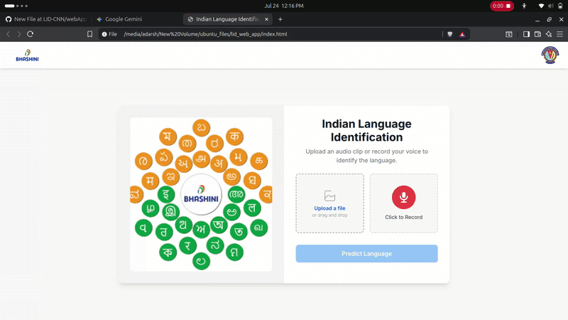

<div align="center">

  <h1 align="center">Bhashini Internship 2025: Speech & Language Technologies for Indian Languages</h1>
  
  <p align="center">
    This repository documents a key project from my Summer 2025 internship with the Digital India Bhashini Mission: a web-based Language Identification (LID) system for diverse Indian languages.
    <br />
    <a href="#-project-demo"><strong>View Demo »</strong></a>
    ·
    <a href="https://github.com/idealxdxrsh/BHASHINI-Internship-2025/issues">Report Bug</a>
    ·
    <a href="https://github.com/idealxdxrsh/BHASHINI-Internship-2025/issues">Request Feature</a>
  </p>
</div>

<div align="center">


</div>

---

## 🚀 Core Contributions & Project Overview

During the internship, my primary focus was on advancing Automatic Speech Recognition (ASR) and Language Identification (LID) systems. This repository showcases one of the key projects: an end-to-end Language Identification system.

### Key Internship Achievements:
-   **Developed a Multilingual LID System** for 10 Indian languages using a CNN architecture on MFCCs.
-   **Fine-tuned state-of-the-art ASR models**, including OpenAI's Whisper and AI4Bharat's IndicWav2Vec.
-   **Improved pronunciation modeling** by integrating `IndicG2P` for phoneme-level analysis.
-   **Implemented a Voice Activity Detection (VAD)** pipeline for preprocessing noisy, real-world audio.

---

## 🎥 Project Demo

Here is a brief demonstration of the Language Identification web application in action.



---

## ✨ Features of this Application

-   **🌐 Multi-Language Support**: Identifies 4 major Indian languages (**Hindi, Malayalam, Marathi, Punjabi**).
-   **🖥️ Web-Based UI**: Easy-to-use interface built with Flask, HTML, and Tailwind CSS.
-   **🎤 Dual Input Modes**: Supports both file upload (`.wav`, `.mp3`) and live audio recording from the microphone.
-   **✂️ Intelligent Slicing**: For audio longer than 5 seconds, the app automatically slices the audio, analyzes each chunk, and returns the prediction with the highest confidence.
-   **📈 Confidence Score**: Displays the model's confidence in its prediction.
-   **⚡ Real-time Feedback**: The UI provides loading states and clear error messages for a smooth user experience.

---

## 🛠️ Technology Stack

-   **Core Technologies:** Python, PyTorch, TensorFlow, HuggingFace Transformers, `librosa`
-   **Model Training:** `Slurm` for distributed training on High-Performance Computing (HPC) clusters.
-   **Deployment & UI:** Flask, HTML, Tailwind CSS, JavaScript, Jupyter Notebooks

---

## 🧠 Model Architecture

The core of this application is a **Convolutional Recurrent Neural Network (CRNN)**.

1.  **CNN Layers**: Act as feature extractors, processing Mel-frequency cepstral coefficients (MFCCs) of the audio to identify relevant patterns.
2.  **RNN Layers**: Bidirectional Gated Recurrent Units (GRUs) process the data sequentially, capturing temporal relationships within the speech.
3.  **Dense Layers**: Fully connected layers classify the features into one of the target languages.

---

## 🚀 Getting Started

To get a local copy up and running, follow these simple steps.

### Installation


1.  **Clone the Repository**
    ```sh
    git clone [https://github.com/idealxdxrsh/BHASHINI-Internship-2025.git](https://github.com/idealxdxrsh/BHASHINI-Internship-2025.git)
    cd BHASHINI-Internship-2025
    ```
2. **Go to the webApp folder**
    ./LID-CNN/WebApp
   

3.  **Create and Activate a Virtual Environment**
    ```sh
    # For Windows
    python -m venv venv
    venv\Scripts\activate

    # For macOS/Linux
    python3 -m venv venv
    source venv/bin/activate
    ```

4.  **Install Dependencies**
    ```sh
    pip install -r requirements.txt
    ```

5.  **Download Model Weights**
    -   Make sure `language_identification_model.h5` is present in the `models/` directory.

6.  **Run the Application**
    ```sh
    python app.py
    ```
    The application will be running at `http://127.0.0.1:5000`.

---

## 📋 How to Use

1.  Navigate to `http://127.0.0.1:5000` in your browser.
2.  **Upload a File**: Drag and drop an audio file or click to select one.
3.  **Record Audio**: Click the microphone button to start/stop recording.
4.  An audio player will appear to preview the audio.
5.  Click **Predict Language**. The result and confidence score will be displayed.

---


---

## 🤝 Contributing

Contributions are greatly appreciated. Please fork the repository and create a pull request.

1.  Fork the Project
2.  Create your Feature Branch (`git checkout -b feature/AmazingFeature`)
3.  Commit your Changes (`git commit -m 'Add some AmazingFeature'`)
4.  Push to the Branch (`git push origin feature/AmazingFeature`)
5.  Open a Pull Request
